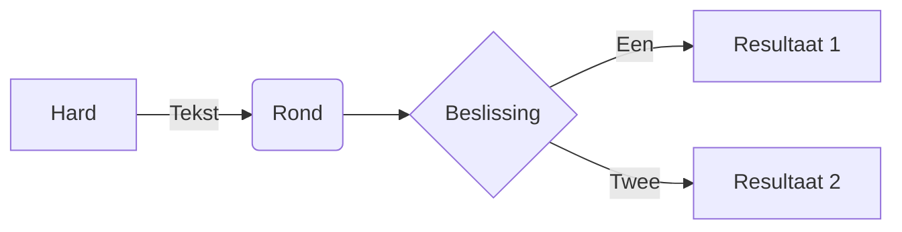
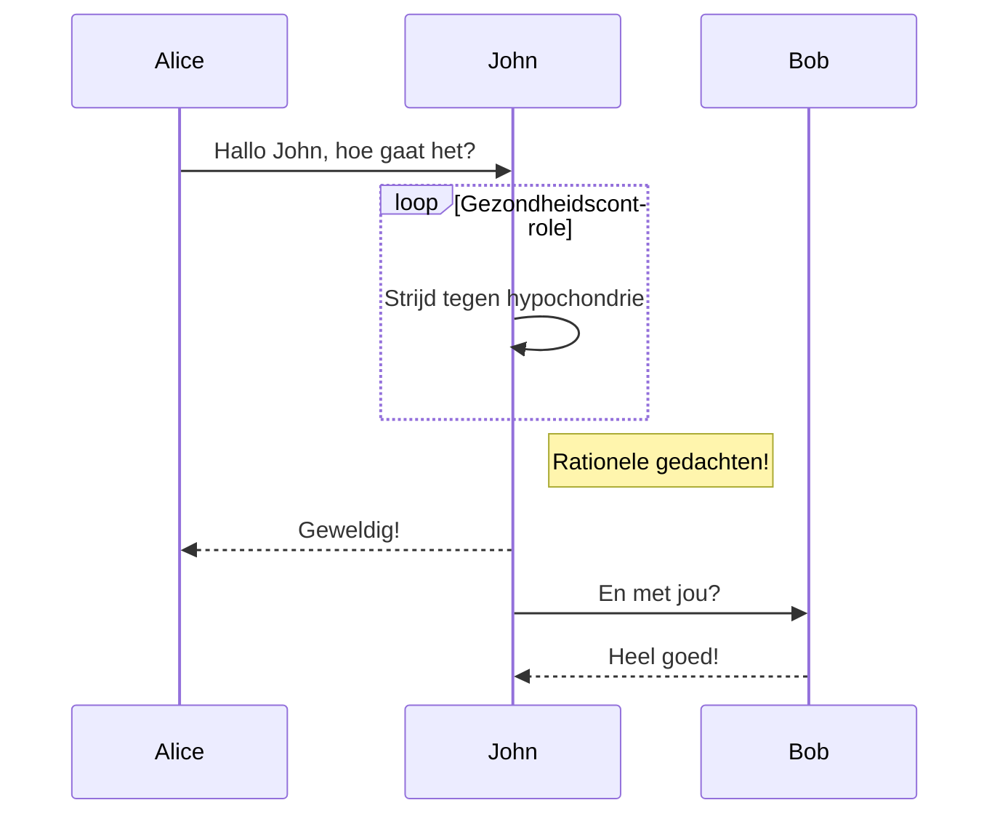
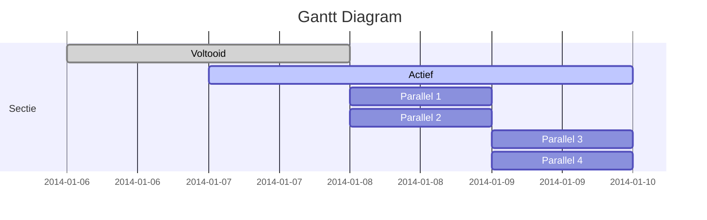
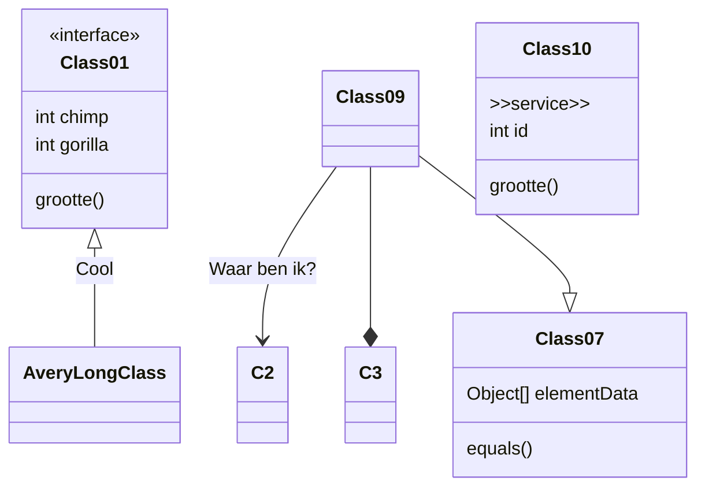
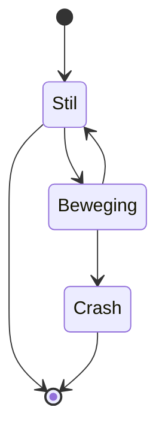
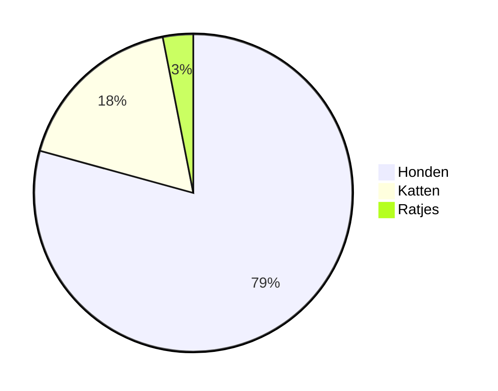
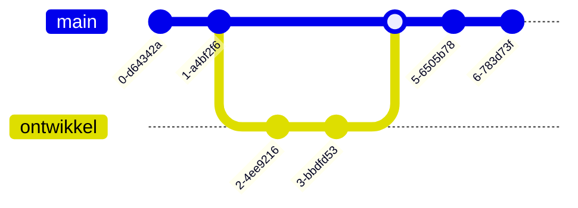
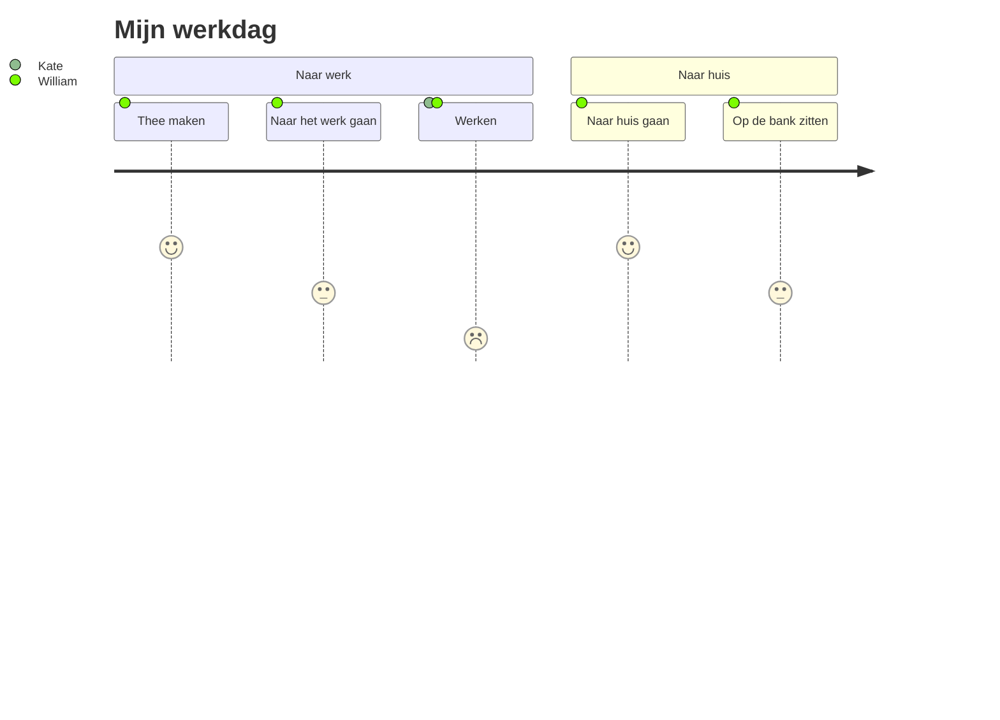
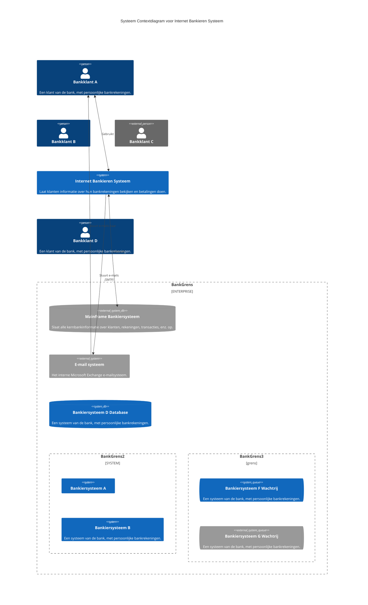

## Stroomdiagram

## Sequentiediagram

## Gantt-diagram

## Klassediegram

## Toestanddiagram

## Taartdiagram

## Git-graph

## Staafdiagram (met gebruik van Gantt-diagram)

```mermaid
gantt
  title Git Issues - dagen sinds laatste update
  dateFormat  x
  axisFormat  %s

  section Issue19062
  71   : 0, 71
  section Issue19401
  36   : 0, 36
  section Issue193
  34   : 0, 34
  section Issue7441
  9    : 0, 9
  section Issue1300
  5    : 0, 5
```

## Gebruikersreisdiagram

## C4-diagram

